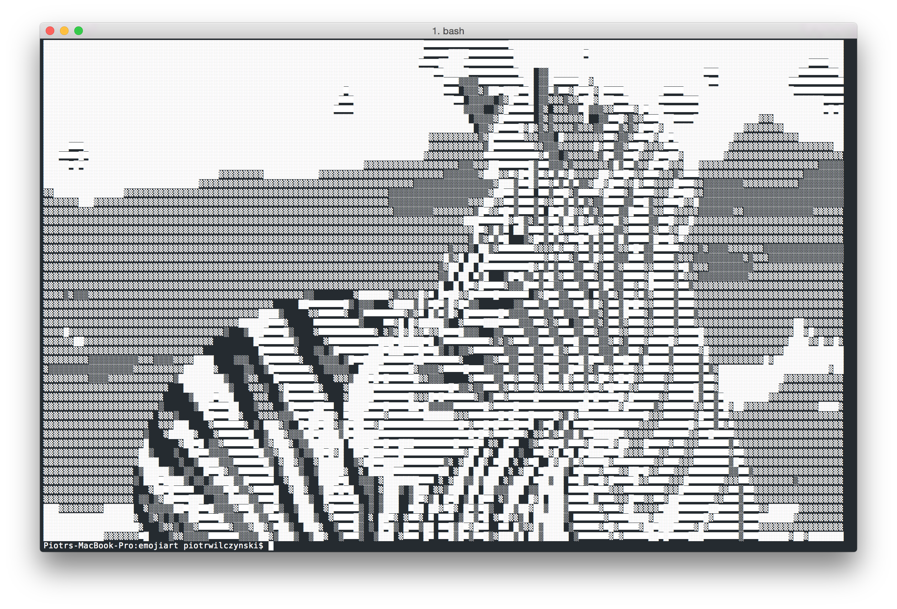

# Emojiart


Convert images to aciiart-like text with unicode symbols or emojis.

```
              ▒▒▒▓▓▓▓▓▓▓▒▒▒
           ▒▒▓▓▓██████████▓▓▒▒
         ▒▒▓▓███████████████▓▓▓▒
        ▒▓▓███████████████████▓▓▒▒
       ▒▒▓█████████████████████▓▓▒
       ▒▓▓█████▓▒▒▓███▓▒░▒█████▓▓▓
      ▒▓▓▓████▓▒▒░▒▓▓▓▒░▒▒▓████▓▓▓▒
      ▒▓▓▓▓▓▓▓▓▒▓▓▒▓▓▓▒▓█▓▓▓▓▓▓▓▓▓▒
      ▒▓▓▓▓▓▓▓█▓▓▓▓▓▓▓▓▓▓▓█▓▓▓▓▓▓▓▒
      ░▒▓▓▓▒░░░░░░░▒▒░░░░░░░░▒▓▓▓▓░
       ▒▓▓▓▓░▒▓███████████▓▒▒▓▓▓▓▓
        ▒▓▓█▓▒▒░░░░░░░░░░░▒▒▓█▓▓▓▒
         ▒▓▓██▓▒▒▒▒▒▒▒▒▒▒▒▓██▓▓▒░
          ░▒▓▓▓██▓▒▒▒▒▓▓▓█▓▓▓▒░
             ░▒▓▓▓▓██▓▓▓▓▓▒░
                 ░░▒▒▒░░

Usage:
    textart.py [-s=<sc>] [-f=<fs>] [-c=<na>] [-b] [-g=<gs>] [-e] [-i] [-j] [-w=<ws>] <path_to_image>

Options:
    -h --help                       Show this screen
    -w=<ws> --width=<ws>            Width of output
    -s=<sc> --scale=<sc>            Resize image by this value before conversion [default: 1.0]
    -f=<fs> --height_to_width=<fs>  Rescale width by this value to match fonts height to width proportion [default: 1.8]
    -c=<na> --symbols_set=<na>      Name of symbols set to use, possible values: small_stars, block3, block2, stars, big_ascii, small_ascii, arrows, block, math [default: small_ascii]
    -b --black_on_white             Reverse symbols set
    -e --edges                      Ascii art is created only from edges
    -i --fill                       Ascii art contains edges
    -j --emoji                      Use emojis
    -g=<gs> --gauss=<gs>            Size of Gauss blur to use when finding edges [default: 0]
```


